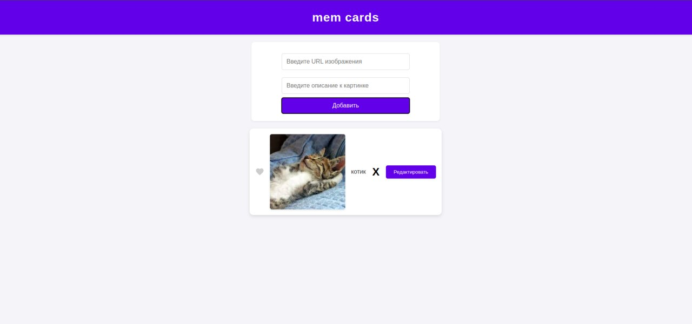

# Mem-Card

## Описание
Приложение для создания карточек с изображениями и текстом.

## Пример интерфейса приложения


## Установка и запуск

### Установка зависимостей
```sh
npm install
```

### Запуск проекта в режиме разработки
```sh
npm start
```
После этого откроется браузер с локальным сервером.

### Сборка проекта для продакшена
```sh
npm run build
```

## Структура проекта
```
/project-root
│── dist/                  # Скомпилированные файлы
│── node_modules/          # Установленные зависимости
│── src/                   # Исходный код
│   ├── assets/            # Картинки и другие ресурсы
│   │── modules/           # Модули
│   ├── styles/            # CSS-стили
│   ├── index.html         # Основной HTML-файл
│   ├── index.js           # Главный JS-файл
│── .babelrc               # Конфиг Babel
│── .gitignore             # Файлы, игнорируемые Git
│── package-lock.json      # Зафиксированные версии пакетов
│── package.json           # Настройки проекта и зависимости
│── postcss.config.js      # Конфиг PostCSS
│── README.md              # Документация проекта
│── webpack.config.js      # Конфигурация Webpack

```

## Используемые технологии
- Webpack
- Babel
- CSS и PostCSS
- JavaScript (ES6+)

## Контакты
[GitHub Репозиторий](https://github.com/1234445666666/mem-card)


